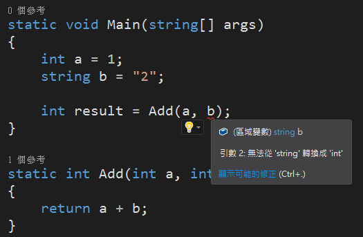
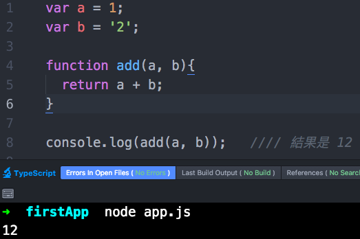
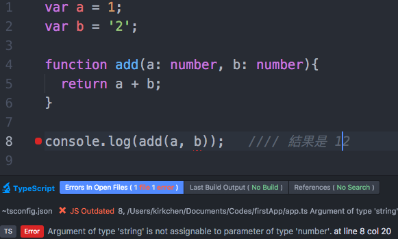
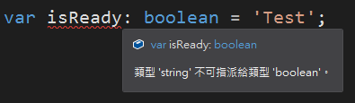

# TypeScript

## Strong Type

強型別語言對於變數的定義檢查比較嚴謹，未依照指定型別傳入參數，在編譯時期就會拋出 Exception。



JavaScript 是偏向弱型別的語言，它也擁有基本型別，但並未禁止不同型別的語法，而是自己判斷目前應該執行的型別進行自動轉換，但也很有可能引發一些預期之外的錯誤。



TypeScript 基於 JavaScript 之語言特性前提供了強型別語法的特性，在編譯時期就可以提醒我們使用了不對的型別，將原本的 JavaScript 改寫也不太費功，只需要替原本的 JavaScript 程式碼補上型別即可。



相較於之前的程式碼，只有額外指定參數的型別，但在執行之前，編輯器就提示可能有錯誤，即可以提前發現問題。

## Primitive Type

TypeScript 預設支援所有 JavaScript 的型別（例如 Boolean、Number、String、Array等等），並額外增加的 Enum 列舉類型。除此之外，所有變數宣告都必須明確指定變數的型別！



### Boolean Type

布林類型 (Boolean) 表示值為 ture/ false ，TypeScript 中使用 Boolean 的方法與 JavaScript 無異，可透過以下方式明確指定變數的類型為 Boolean

```typescript
var isReady: boolean = true;
```

宣告變數之後，使用變數如以下範例：

```typescript
if(isReady){
    //// 程式碼放這裡
}

if(isReady === true) {
    //// 程式碼放這裡
}
```

