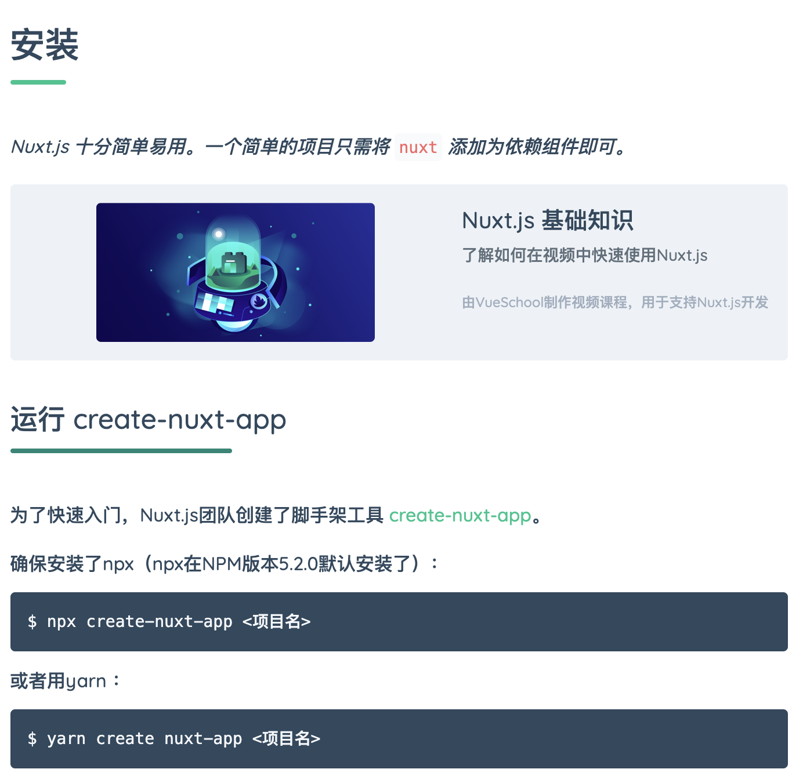

## 建立 Gitlab 專案

[Gitlab](https://gitlab.com/) 是與 Github 齊名的源碼管控平台。在 Gitlab 註冊登入後即出現以下畫面。點選 **Create a project** 來進行創建新的專案。


填入必要資訊後，點選 **Create project** 建立專案。


專案創建完成


置頂的訊息中有 You won't be able to pull or push project code via SSH until you add an SSH key to your profile 內容，請先忽略。

## 安裝 Nuxt

### 參考文件

到 Nuxt 官網，目前官網有支援多國語系。可以從以下兩個語系來著手：

- [英文](https://nuxtjs.org/)
- [中文](https://zh.nuxtjs.org/)

開啟中文官網，點選**開始使用**


Nuxt 官網很貼心，直接就告訴你怎麼安裝，只要按圖操作即可完成。這裡有兩個重點要說明，

* Nuxt 團隊打造了創建工具 [create-nuxt-app](https://github.com/nuxt/create-nuxt-app)。這是一套 Nuxt CLI 工具，提供 CLI 介面可以在短時間建立 Nuxt 專案。
* npx 會在安裝完 create-nuxt-app 後來創建 Nuxt 專案，然後就把 create-nuxt-app 給刪除掉。



### 執行 npx

創建 Nuxt 專案

```bash
$ sudo npx create-nuxt-app hello-nuxt

create-nuxt-app v3.1.0
✨  Generating Nuxt.js project in hello-nuxt
? Project name: hello-nuxt
? Programming language: JavaScript
? Package manager: Npm
? UI framework: None
? Nuxt.js modules: 
? Linting tools: (Press <space> to select, <a> to toggle all, <i> to invert selection)
? Testing framework: None
? Rendering mode: Universal (SSR / SSG)
? Deployment target: Server (Node.js hosting)
? Development tools: jsconfig.json (Recommended for VS Code)

．．．．．(中間會有一大堆雜七雜八的安裝訊息)．．．．．

🎉  Successfully created project hello-nuxt

  To get started:

			cd hello-nuxt
			npm run dev

  To build & start for production:

			cd hello-nuxt
			npm run build
			npm run start
```

創建後可能在 `git commit` 時就會遭遇權限問題，通常建議是重新刪除 .git 資料夾，再次綁定 local repository 到 remote repository 的綁定關係。

```bash
$ cd hello-nuxt & sudo rm -rf .git
$ git init
$ git remote add origin https://gitlab.com/nobody/hello-nuxt.git
$ git add .
$ git commit -m "create a nuxt project."
```

專案初建時只會有一個分支 `master`，可以用`git branch`了解目前所在的分支。

```bash
$ git branch
* master
```

為了方便專案開發與管理，需要再另行創建分支(branch)並切換至該分支。假設現在要創建分支 `dev`

```bash
$ git branch dev
$ git branch
  dev 
* master

$ git checkout dev
```

OK，現在就可以把Nuxt專案裡的程式碼放到 gitlab 所在的 remote repository了。

```bash
$ git push -u orign dev

Username for 'https://gitlab.com': nobody@gmail.com
Password for 'https://nobody@gmail.com@gitlab.com': 
枚舉物件: 29, 完成.
物件計數中: 100% (29/29), 完成.
使用 4 個執行緒進行壓縮
壓縮物件中: 100% (25/25), 完成.
寫入物件中: 100% (29/29), 113.11 KiB | 4.04 MiB/s, 完成.
總共 29 (差異 2)，復用 0 (差異 0)，重用包 0
remote: 
remote: To create a merge request for dev, visit:
remote:   https://gitlab.com/nobody/hello-nuxt/-/merge_requests/new?merge_request%5Bsource_branch%5D=dev
remote: 
To https://gitlab.com/nobody/hello-nuxt.git
 * [new branch]      dev -> dev
分支 'dev' 設定為追蹤來自 'origin' 的遠端分支 'dev'。
```

