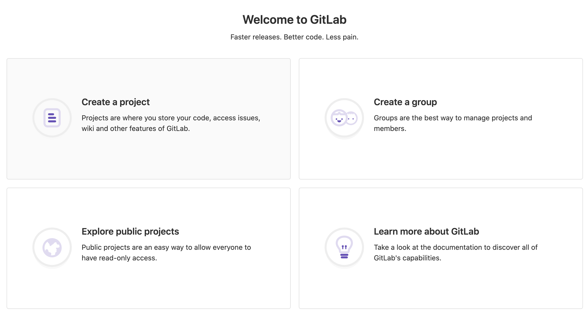
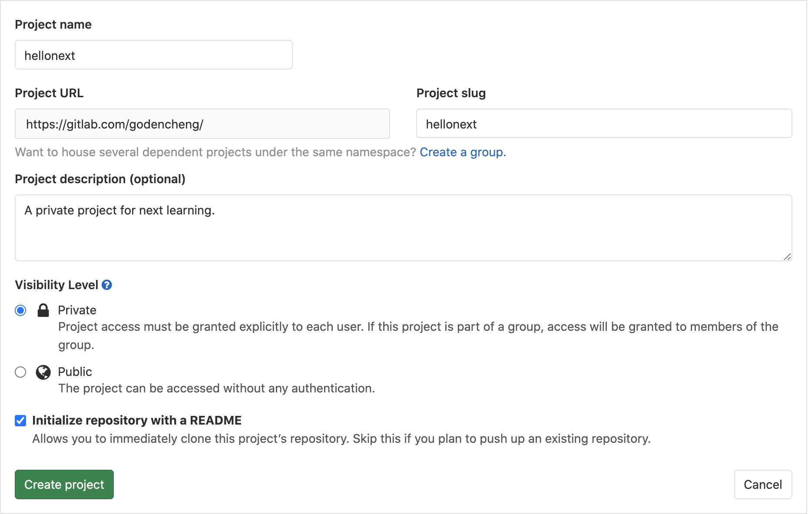
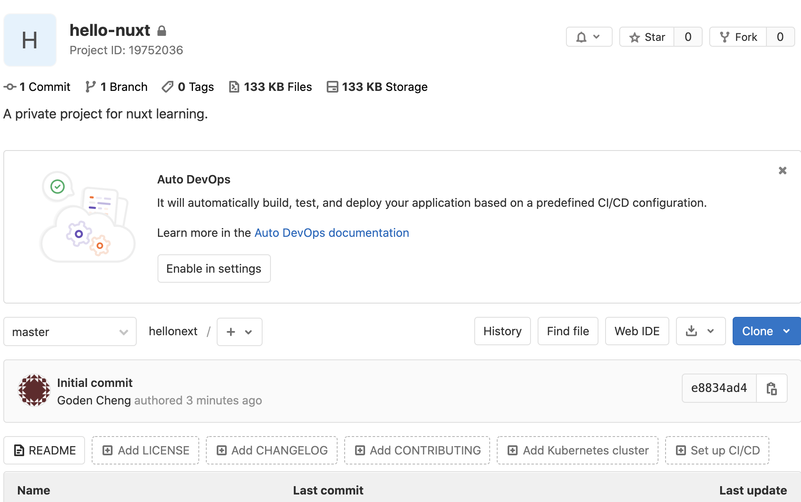

## 建立 Gitlab 專案

[Gitlab](https://gitlab.com/) 是與 Github 齊名的源碼管控平台。在 Gitlab 註冊登入後即出現以下畫面。點選 **Create a project** 來進行創建新的專案。

填入必要資訊後，點選 **Create project** 建立專案。

專案創建完成

## 安裝 Nuxt

到 Nuxt 官網

- [英文](https://nuxtjs.org/)
- [中文](https://zh.nuxtjs.org/)

