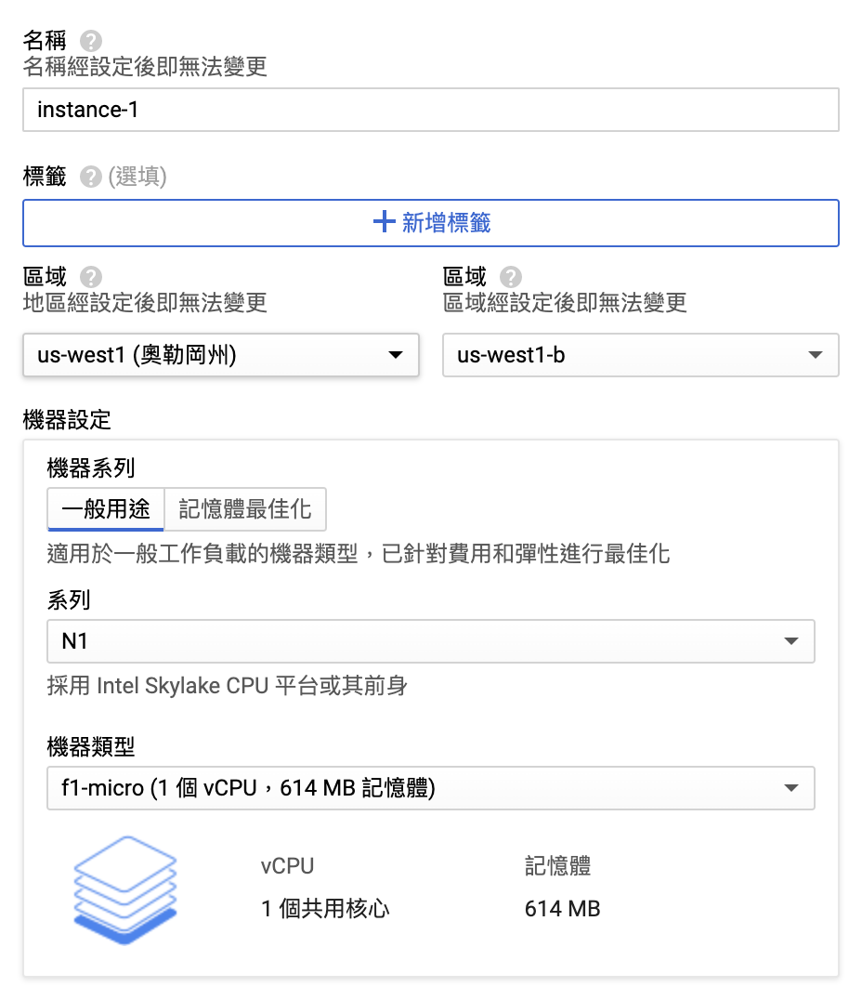
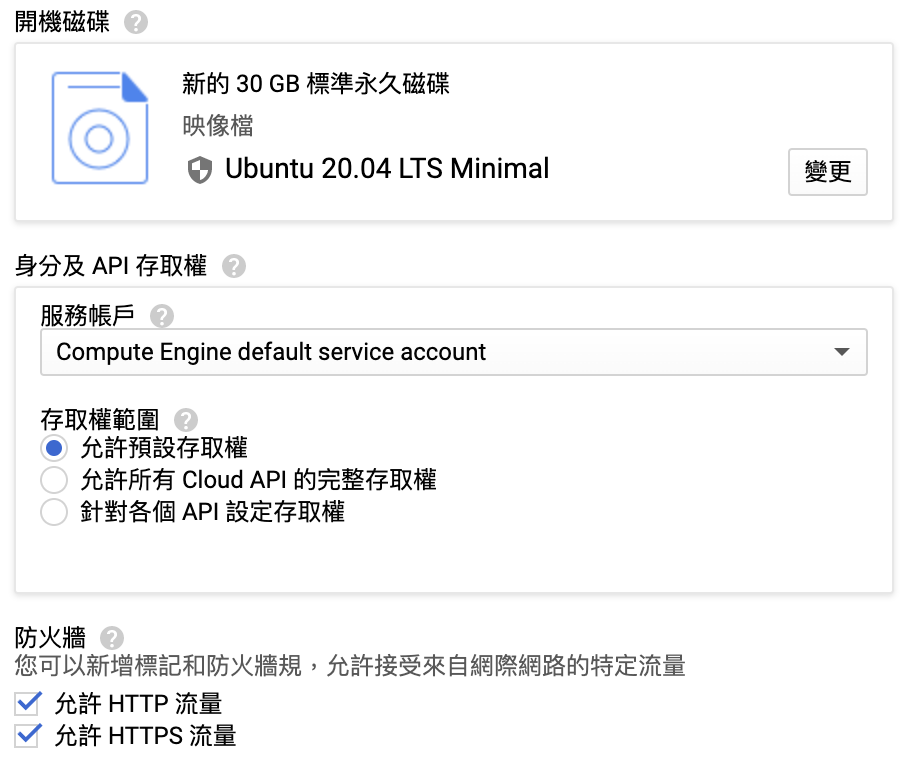

# Google Cloud Platform 免費方案

Google Cloud Platform (GCP) 優惠分為兩個部分，一個是12個月免費(300元)與一律免費的部份，較常使用的 Compute Engine 則為一律免費，當月使用 **f1-micro** 執行個體的前 720 小時完全免費。

**f1-micro** 在 **us-west1**(奧勒岡州)、**us-central1**(愛荷華州)與 **us-east1**(南卡羅來納州)三個地區才有在免費當中，規格是 vCPU 1 個共用核心，記憶體614 MB。因為規格相同，可挑選對於所在地 ping 值較低的區域。

開機磁碟的設置則可點選**變更**將硬碟空間提升為30GB並設定為**Ubuntu 20.04 LTS Minimal**的標準永久磁碟。

要創建Compute Engine時也會提示，本月使用執行個體的前 720 (744) 小時完全免費。

建立完畢即出現以下畫面

