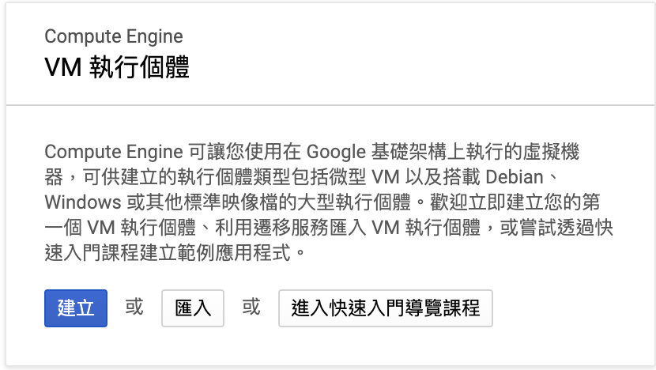

# 在 Google Cloud Platform 創建 VM

## 新增或選取專案

登入 Google Cloud Platfrom Console 後，參考以下步驟進行新增專案

1. 點選**新增專案** (或選取特定專案也行)
   
2. 如果是新增專案，要直接輸入**專案名稱**後，輸入**建立**來建立專案。
   

## 建立 VM 執行個體

在建立或選取完專案後，就要在專案中建立 VM 執行個體。

1. 確認目前選取專案
   
2. 參考本步驟切換至 **VM 執行個體** 項目
   
3. 在確認視窗中選取 **建立** 後即可開始選取 VM 的套餐內容
   
4. 依據實際情況建立合適的 VM 執行個體，建議使用 Ubuntu 以利後續學習。可以使用GCP免費額度(300美金)來建立所需環境，或參考 [Google Cloud Platform 免費方案](./GCP_FREE.md)來建立 VM 執行個體。

