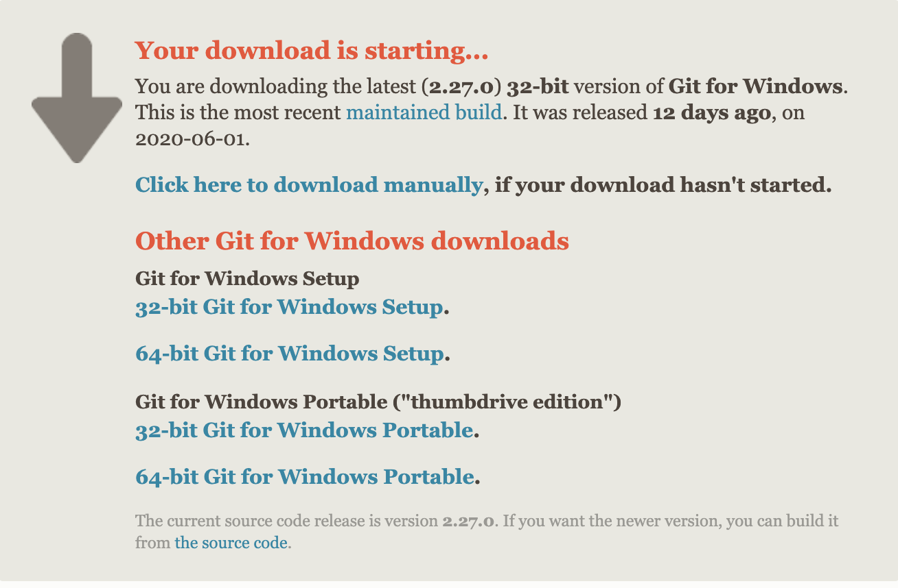
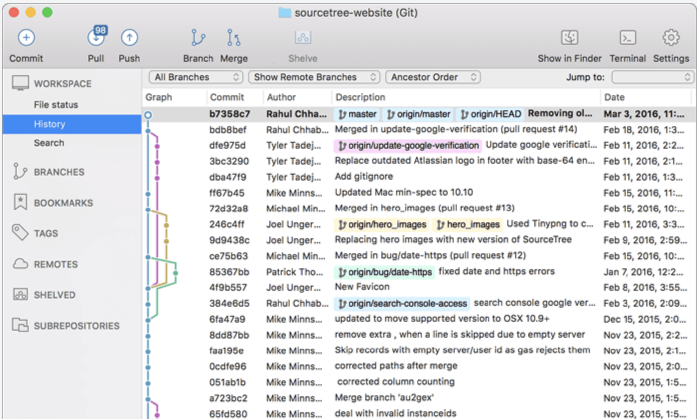
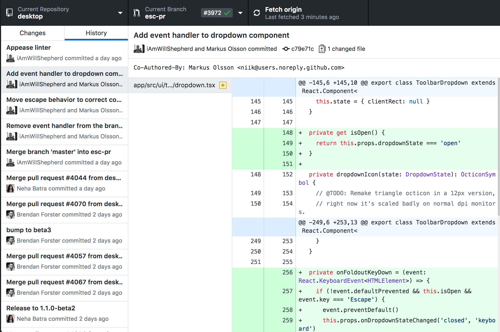

# Git

版本控制系統是早已成為近代軟體工程必備技術之一，成員間的軟體版本可以同步和維護管理程式碼。

版本控制系統可分為 Central（中控式，例：[Subversion](https://zh.wikipedia.org/wiki/Subversion)、[CVS](https://zh.wikipedia.org/wiki/協作版本系統) 等）與 Distributed（分散式，例：[Git](https://git-scm.com/)、[BitKeeper](https://blog.techbridge.cc/2018/01/17/learning-programming-and-coding-with-python-git-and-github-tutorial/BitKeeper)、[mercurial](https://zh.wikipedia.org/zh-tw/Mercurial) 等），中控式的運作方式將所有程式碼控制集中於主要一個伺服器進行，成員間對於程式碼的管理只能透過單一中控式的伺服器來進行分享與同步。分散式的運作方式則允許讓各成員直接擁有在各自的本地檔案庫工作，各成員的本地檔案庫又可以與主要的中控式管理系統進行程式碼同步。即便是中控伺服器無法運作，即陷入無法運作的狀況下，程式碼尚能進行最大限度的保留，待服務恢復後即可再行同步與分享。

## Mac

可以分兩種方式來安裝

- 直接下載安裝檔安裝 - https://git-scm.com/
- 透過 Homebrew 安裝 - `brew install git` (參考[Homebrew安裝](../Homebrew/README.md))

## Windows

直接透過下載安裝檔進行安裝 - https://git-scm.com/download/win



可點選合適的系統版本進行下載安裝，安裝完畢後可使用Git Bash進行驗測。Git Bash 與命令提示字元的差異在於，它是模擬在Linux裡很常用應用軟體，bash。

## Linux

linux安裝應該算是最省事的，只要記得用`apt-get`搭配 root 權限，就可以自己下載安裝好。

```bash
sudo apt-get install git
```

## 查詢 Git 版本

輸入以下指令查詢安裝目錄與版本資訊

```bash
which git & git —version
```

## Git GUI

在 [Git官網](https://git-scm.com/downloads/guis) 上有很多 GUI 工具的介紹，較廣為人知的就是 Github Desktop 與 Source Tree了。

- [SourceTree](https://www.sourcetreeapp.com/)
  

- [Github Desktop](https://desktop.github.com/)
  

對於 Linux 用戶來說，上述兩個軟體都無法安裝。建議使用 gitk，可以使用以下指令來安裝：

```bash
$ sudo apt-get install gitk
```

雖然沒有像 SourceTree 與 Github Desktop 那麼好用，但基本功能都有支援。

## 基本 Git 指令

- 初始化。在目錄執行 `git init` 指令，代表該目錄(含以下所有目錄)都要列入 git 控管

  ```bash
  $ cd /tmp/ & git init
  ```

- 查詢狀態

  ```bash
  $ git status
  ```

- 將異動內容加到暫存區。說得明白點就是將檔案納入 git 管理

  ```bash
  $ git add /tmp/demo.html
  ```

- 將暫存區的異動內容交付到 local repository

  ```bash
  $ git commit -m "initialize the demo"		//交付異動
  $ git commit --amend -m "re-initialize"		//修改最後一次交付訊息
  ```

- 當把暫時區的異動都交付至 local repository 後，用 `git log` 來查詢異動記錄

  ```bash
  $ git log 	//查詢異動記錄
  $ git log --online --author="goden"		//查詢goden的異動記錄
  $ git log --online --author="goden\|mike"		//查詢goden或mike的異動記錄
  $ git log --online --grep="Bugfix"		//查詢交付訊息中有Bugfix字樣的記錄
  $ git log -S "Demo"				//查詢交付異動檔案中有Demo內容的記錄
  ```

- 刪除異動檔案

  ```bash
  $ git rm /tmp/demo.html		//刪除特定檔案
  
  // 相當於以下兩個指令的結合
  $ rm /tmp/demo.html & git add /tmp/demo.html
  ```

- 變更異動檔名

  ```bash
  $ git mv /tmp/demo.html	/tmp/hello.html		//變更特定檔案
  
  //相當於以下指令的結合
  $ mv /tmp/demo.html /tmp/hello.html & git add /tmp/hello.html
  ```

- 查詢特定行數(範圍)程式碼的始作俑者

  ```bash
  $ git blame /tmp/demo.html
  $ git blame -L 1,10 /tmp/demo.html		//查詢特定行數的程式碼異動記錄
  ```

- 查詢目前分支、創建新分支

  ```bash
  $ git branch
  $ git branch newbranch
  ```

- 切換到新分支

  ```bash
  $ git checkout newbranch
  ```

- 將程式碼從本地端儲存庫(Local Repository)推送到遠端儲存庫(Remote Repository)

```bash
$ git push -u origin dev
```

