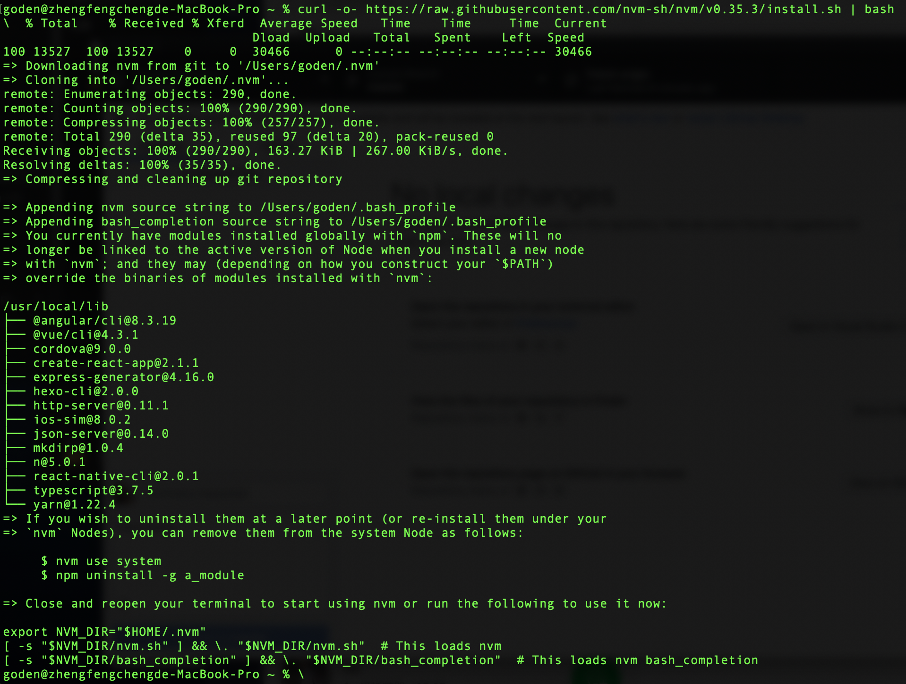

# NodeJS

基於 Chrome V8 engine 打造而成的 javascript runtime.

官網：https://nodejs.org/zh-tw/

NodeJS 可區分為 LTS 與 Current 版本：

- **LTS**，**L**ong-**T**erm **S**upport。官方長期維謢的穩定版，建議大家採用LTS版本。(目前最新版本為**12.18.0**)
- **Current**，屬於嘗鮮版本，新功能可於此版出現。

## 安裝

下載網址：https://nodejs.org/zh-tw/download/

目前支援 Windows、Mac 與 Linux 版本。如果本身已經有安裝過 NodeJS，再安裝會將系統原有的版本給覆蓋掉成新的版本。

如果對 NodeJS有多版本的需求，可以參考以下章節來了解NVM的安裝方式與使用方式。

## NVM

**N**odeJS **V**ersion **M**anager，NodeJS 版本管理系統。支援管理個人主機上的所有NodeJS版本，安裝NVM即是為了管理不同版本的NodeJS。

### 各平台安裝方式

#### Mac

```bash
curl -o- https://raw.githubusercontent.com/nvm-sh/nvm/v0.35.3/install.sh | bash
```

安裝後的畫面如下，安裝完成必須要重啟終端機讓本次安裝生效：



如果安裝後發生 command not found 的情況，可執行以下script來嘗試解決~

```bash
export NVM_DIR="$([ -z "${XDG_CONFIG_HOME-}" ] && printf %s "${HOME}/.nvm" || printf %s "${XDG_CONFIG_HOME}/nvm")"
[ -s "$NVM_DIR/nvm.sh" ] && \. "$NVM_DIR/nvm.sh"
```

如果還是無法解決問題，參考 [NVM官網說明](https://github.com/nvm-sh/nvm#troubleshooting-on-macos)。

#### Linux

執行以下指令來安裝 NVM

```bash
wget -qO- https://raw.githubusercontent.com/nvm-sh/nvm/v0.35.3/install.sh | bash
```

如果安裝後發生command not found的情況，可以關閉終端機再重啟，然後輸入以下指令再驗證看看結果為何。

```bash
command -v nvm
```

#### Windows

可以至Windows NVM的github專案 ([windows-nvm](https://github.com/coreybutler/nvm-windows/releases)) 下載套新版本

### NVM 指令

查詢現有系統安裝的node版本

```bash
goden@goden ~ % nvm ls
->       system
iojs -> N/A (default)
node -> stable (-> N/A) (default)
unstable -> N/A (default)
nvm_list_aliases:36: no matches found: /Users/goden/.nvm/alias/lts/*
```

查詢有那些nodejs版本可以安裝(本功能 windows 版本不支援)

```bash
nvm ls-remote
```

安裝指定版本

```bash
nvm install v12.18.0
```

使用特定版本

```
nvm use v12.18.0
```

更改預設版本

```bash
nvm alias default v12.18.0
```
